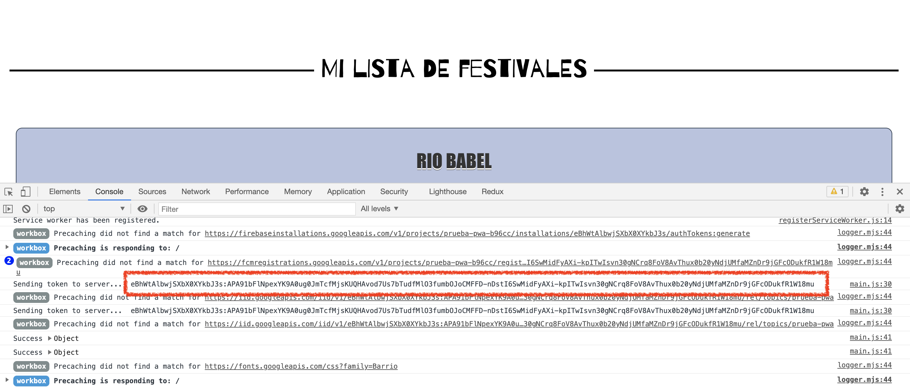

# vuevixens-pwa

## Pasos para crear proyecto de una Progressive Web App (PWA) con Vue

Para poder seguir este tutorial el necesario tener instalado `npm` y `vue CLI`.

Comprueba si los tienes intalado con:
```
npm -v
vue --version
```

Si necesitas instalar los paquetes básicos:
- Node y npm: https://nodejs.org/es/
- Vue: `npm install -g @vue/cli`  (https://cli.vuejs.org/guide/installation.html)

### ¿Qué aplicación vamos a hacer?   
Vamos a crear una app para listar festivales de música, la aplicación consta de una pantalla inicialmente vacía con un botón añadir que nos redirige a la página de crear un elemento nuevo, una vez creado se redirige a la página principal con el listado de elementos añadidos. El aspecto es el siguiente:

   
<br/>
   
<br/>
    


## 0. Elección del tutorial

Para este tutorial se planean dos opciones:

1. **Proyecto completo:** realizar el proceso completo y empezar creando el proyecto de Vue, para lo que continuaremos con estas instrucciones.
2. **Aplicación de Vue creada**: crear una PWA a partir de la aplicación Vue con opción de PWA ya creada, para ello es necesario cambiar a la rama `main-app` y continuar con esas instrucciones.

## 1. Creación del proyecto
Creamos un proyecto nuevo de Vue llamado `vuevixens-pwa` ejecutando en consola:

`vue create vuevixens-pwa`

Selecciona la siguiente configuración para el proyecto:

> Manually select features

- Babel
- Progressive Web App (PWA) Support
- Router
_ Vuex
- CSS Pre-processors
- Linter / Formatter

> ? Use history mode for router? **No**   
> ? Pick a CSS pre-processor (PostCSS, Autoprefixer and CSS Modules are supported by default): **Sass/SCSS (with dart-sass)**
> ? Pick a linter / formatter config: **ESLint with error prevention only**   
> ? Pick additional lint features: **Lint on save**   
> ? Where do you prefer placing config for Babel, EsLint, etc.? **In package.json**   
> ? Save this as a preset for future projects? **n**   

## 2. Creación de la aplicación web

Vamos a crear una aplicación que utilizaremos para crear nuestro listado de festivales de música favoritos, la aplicación consta de una pantalla inicialmente vacía con un botón añadir que nos redirige a la página de crear un elemento nuevo. Una vez se crea el elemento se almacena en el almacenamiento local (localStorage) de nuestro navegador. Para crear esta aplicación seguiremos los siguientes pasos:

1. Creamos un nuevo componente que será el resumen de cada festival que se añade a nuestro listado de festivales. En la ruta `src/components` creamos un nuevo fichero llamamdo `FestivalItem.vue` con el siguiente contenido:

primero instalamos la dependencia del componente de seleccion de fecha ejecutando en la terminal:   
 `npm i vue-date-pick`  

y comprobamos que se ha instalado correctamente si aparece como dependencia en el fichero package.json

Incluimos el siguiente código en el fichero `FestivalItem.vue`:
```
<template>
  <div class="festival-item-wrapper">
    <h1>{{ festivalData.name }}</h1>
    <div class="data-wrapper">
      <div class="image-wrapper">
        
      </div>
      <date-pick class="calendar" v-model="festivalData.date" :hasInputElement="false"></date-pick>
      <button class="delete-button" @click="removeItem">Eliminar</button>
    </div>
  </div>
</template>

<script>
import DatePick from 'vue-date-pick';
import 'vue-date-pick/dist/vueDatePick.css';

export default {
  name: 'FestivalItem',
  components: {
    DatePick
  },
  props: {
    festivalData: Object
  },
  methods: {
    removeItem() {
      localStorage.removeItem(this.festivalData.id)
      location.reload()
    }
  }
}
</script>

<style lang="scss">
.festival-item-wrapper {
  border: 1px solid;
  border-radius: 10px;
  margin: 10px;
  background-color: #b8c2e0;

  h1 {
      margin: 1em 0 0.5em 0;
      color: #343434;
      font-weight: bold;
      font-family: Impact, Charcoal, sans-serif;   
      font-size: 30px;
      line-height: 42px;
      text-transform: uppercase;
      text-shadow: 0 2px white, 0 3px #777;
    }

  .data-wrapper {
    overflow-x: auto;
    display: flex;
    align-items: center;

    .image-wrapper {
      position: relative;
      margin: auto;
      width: 30%;
      height: auto;

      img {
        width: 100%;
      }
    }

    .calendar {
      width: min-content;
      margin: 15px;
    }

    .delete-button {
      background: red;
      border: 1px solid #f00;
      border-radius: 2em;
      color: whitesmoke;
      display: inline-block;
      font-size: 14px;
      font-weight: bold;
      height: 20px;
      line-height: 2px;
      margin: auto;
      padding: 10px;
      text-align: center;
      cursor: pointer;
    }
  }

  @media screen and (max-width: 450px) {
    .data-wrapper {
      margin-bottom: 5px;
      flex-direction: column;
    }
  }
}
</style>
```

2. A continuación creamos una nueva vista para añadir un nuevo festival, esta vista consta de un formulario de tres campos: nombre, imagen y fecha. Para simplificar la lógica en el campo imagen sólo se aceptan URLs de imagen. En la ruta `src/views` creamos un nuevo fichero llamado `CreateFestivalItem.vue` con el siguiente contenido:
```
<template>
  <div>
    <p class="page-title">Introduce datos del nuevo festival</p>
    <form
      id="app"
      @submit="addItem"
    >
      <p>
        <label for="name">Nombre</label>
        <input
          id="name"
          v-model="name"
          type="text"
          name="name"
        >
      </p>

      <p>
        <label for="image">Imagen</label>
        <input
          id="image"
          v-model="image"
          type="text"
          name="image"
          placeholder="URL de la imagen">
      </p>

      <p>
        <label for="date">Fecha</label>
        <input type="date" v-model="date" />
      </p>

      <p>
        <input
          class="button"
          type="submit"
          value="Guardar"
        >
      </p>

    </form>
  </div>
</template>

<script>
export default {
  name: 'CreateFestivalItem',
  data() {
    return {
      name: null,
      image: null,
      date: null
    }
  },
  props: {
  },
  methods: {
    addItem(ev) {
      if (this.name && this.date) {
        let id = Math.random().toString(36).substring(2, 4) + Math.random().toString(36).substring(2, 4);
        const newFestival = {
          id: 'festival-' + id,
          name: this.name,
          image: this.image,
          date: this.date
        }
        localStorage.setItem(newFestival.id, JSON.stringify(newFestival))
      }
      ev.preventDefault();

      this.$router.push('/');
    }
  }
}
</script>

<style lang="scss">
@import url(https://fonts.googleapis.com/css?family=Barrio);

.page-title {
  font-family: "Barrio";
  color: black;
  text-align: center;
  font-size: 40px;
}
.button {
  background-color: #6d737a;
  font-family: "Barrio";
  color: white;
  padding: 15px;
  font-size: 16px;
  border-radius: 5px;
  font-weight: bold;
  box-shadow: 0 4px 8px 0 rgba(0, 0, 0, 0.2), 0 6px 20px 0 rgba(0, 0, 0, 0.19);
}

label {
  margin-right: 5px;
}
</style>
```

3. Creamos nuestra pantalla principal en el fichero `Home.vue` (ubicado en la ruta `src/views/`) para que muestre un listado de festivales (compenente creado en el paso 1) y un botón con la opción de añadir. El contenido del fichero es:
```
<template>
  <div class="home">
    <div class="plate">
      <p class="page-title"><span>   Mi lista de festivales   </span></p>
    </div>
    <festival-item v-for="(item, index) in festivalList"
      :key="index"
      :festival-data="item"/>
    <router-link class="button" to="/create-item">Nuevo festival</router-link>
  </div>
</template>

<script>
// @ is an alias to /src
import FestivalItem from '@/components/FestivalItem.vue';

export default {
  name: 'Home',
  components: {
    FestivalItem
  },
  data() {
    return {
      festivalList: []
    }
  },
  mounted() {
    // Check if already has any festival item saved in localStorage
    let storageItemsKeys = Object.keys(localStorage);
    let storageItemsCounter = storageItemsKeys.length;

    while ( storageItemsCounter-- ) {
      if (storageItemsKeys[storageItemsCounter].includes('festival')) {
        this.festivalList.push(JSON.parse(localStorage.getItem(storageItemsKeys[storageItemsCounter])))
      }
    }
  }
}
</script>

<style lang="scss">
@import url(https://fonts.googleapis.com/css?family=Barrio);

.home {
  padding: 10px;

  .plate {
    width: auto;
    margin: 5% auto;
  }

  .page-title {
    font-family: "Barrio";
    color: black;
    text-align: center;
    font-size: 40px;
    position: relative;
    margin:0;
  }

  .page-title span {
    background-color: white;
    padding: 0 10px;
  }

  .page-title:before {
    content: "";
    display: block;
    position: absolute;
    z-index:-1;
    top: 50%;
    width: 100%;
    border-bottom: 3px solid black;
  }

  .button {
    background-color: #6d737a;
    font-family: "Barrio";
    border: none;
    color: white;
    padding: 15px;
    text-align: center;
    text-decoration: none;
    display: inline-block;
    font-size: 16px;
    margin: 4px 2px;
    border-radius: 5px;
    font-weight: bold;
    box-shadow: 0 4px 8px 0 rgba(0, 0, 0, 0.2), 0 6px 20px 0 rgba(0, 0, 0, 0.19);
  }
}
</style>
```

4. Por último hay que indicar las rutas de nuestra aplicación para las distintas vistas en el fichero `/src/router/index.js` con el siguiente contenido:
```
import Vue from 'vue'
import VueRouter from 'vue-router'
import Home from '../views/Home.vue'

Vue.use(VueRouter)

const routes = [
  {
    path: '/',
    name: 'Home',
    component: Home
  },
  {
    path: '/create-item',
    name: 'create-item',
    // route level code-splitting
    // this generates a separate chunk (about.[hash].js) for this route
    // which is lazy-loaded when the route is visited.
    component: () => import(/* webpackChunkName: "about" */ '../views/CreateFestivalItem.vue')
  }
]

const router = new VueRouter({
  routes
})

export default router
```

5. Limpiar la aplicación:

En el fichero `App.vue` tenemos un enrutado por defecto que nos genera Vue, podemos quitarlo borrando las siguientes lineas del fichero:

```
<div id="nav">
  <router-link to="/">Home</router-link> |
  <router-link to="/about">About</router-link>
</div>
```

Con esto ya tendríamos nuestra aplicación básica creada, la probamos ejecutando `npm run serve` pero... ¡¡esto no es una PWA!!

## 3. Configuración de la PWA

Crear nuevo fichero `vue.config.js` en la raiz del proyecto (al nivel de package.json) y pegar el siguiente contenido:

```
module.exports = {
  pwa: {
    name: "Mis festivales favoritos",
    startUrl: "index.html",
    display: "standalone", //display ascpect (normal, fullscreen or minimal-ui)
    themeColor: "#3eb984",
    backgroundColor: "#fff",
  }
}

```

## 4. Ejecutar la aplicación
Para lanzar la aplicación y poderla usar en modo PWA es necesario lanzarla en modo producción en el entorno local, para ello:

1. Necesitamos el paquete `serve` que nos permitirá crear un servidor local para la lanzar la aplicación. Lo instalamos ejecutamos en la consola (podemos comprobar si ya lo tenemos instalado con `serve -v` y nos saltamos este paso):
```
sudo npm install -g serve
```

2. Creamos el paquete de producción del proyecto:
```
npm run build
```
   
3. Lanzamos la app generada para producción en entorno local, desde la raíz del proyecto ejecutamos en consola:

```
serve dist/
```

4. Comprobamos que los serviceWorker están funcionando:   
Accedemos a la consola de desarrollo del navegador e inspeccionamos la aplicación.


5. Comprobamos que la aplicacioón es instalable en nuestro dispositivo:   
- En el ordenador: desde el navegador, en la barra de URLs nos aparece la opción "instalar aplicación" y también en el menú "más opciones" del navegador nos aparece la opción de instalar.

## 5. Inlcuir notificaciones push
Para incluir este tipo de notificaciones en nustra aplicación, en primer lugar debemos tener un servidor que gestionará las notificaciones, en este caso utilizaremos el servicio de Firebase y lo configuraremos de la siguiente forma:

1. Ir a la consola de firebase (https://console.firebase.google.com/?hl=es-419&pli=1), también se puede buscar en Google "Firebase".   
2. Crear un nuevo proyecto en firebase con el nombre deseado (vuevixens-pwa) y aceptar las condiciones de uso.   
3. Ir a configuración, en la parte izquierda superior, pinchar sobre el icono de configuración y seleccionar “Configuración del proyecto”:


Ir a la pestaña "Cloud Messaging", al final de este apartado aparece la opción para activar los certificados push web. Hacemos click en "Generar par de claves" y nos aparecerá una clave junto con la fecha de creación.   

4. En nuestro proyecto Vue también tendremos que instalar algunas dependencias de axios (para hacer peticiones HTTP) y firebase. Ejecutamos en la consola los siguientes comandos:
```
npm install axios --save

sudo npm install --save firebase
```


5. En el proyecto creamos un nuevo fichero llamado `firebase-messaging-sw.js` en la ruta public/ con el siguiente contenido. Dónde MessagingSenderId será nuestro "Id de remitente" de firebase: 
```
importScripts('https://www.gstatic.com/firebasejs/5.5.6/firebase-app.js');
importScripts('https://www.gstatic.com/firebasejs/5.5.6/firebase-messaging.js');

firebase.initializeApp({'messagingSenderId': "xxxxxxx"});

const messaging = firebase.messaging();
```   


6. Creamos otro nuevo fichero llamado `firebase-config.js` en la carpeta `src/` con el siguiente contenido:
```
import firebase from 'firebase/app';
import 'firebase/messaging';

export const Firebase = {
  init() {
    const config = {
      apiKey: "xxxx",
      authDomain: "vuevixens-pwa.firebaseapp.com",
      databaseURL: "https://vuevixens-pwa.firebaseio.com",
      projectId: "vuevixens-pwa",
      storageBucket: "vuevixens-pwa.appspot.com",
      messagingSenderId: "xxxx",
      appId: "xxxxxxxx",
      measurementId: "xxxx"
    };
    
    firebase.initializeApp(config);
  },

  messaging() {
    const msg = firebase.messaging();

    console.log('Set firebase messaging config')

    return msg;
  }
}

export default Firebase
```

La configuración se puede obtener de la consola de firebase: apartado "Configuración de proyecto" --> "general", en la parte inferior "Tus apps", creamos una app para plataforma web con el sobrenombre deseado (vuevixens-pwa) y nos aparecerá la secuencia de comandos deseada:


7. Por último añadimos la configuración necesaria para enviar notificaciones en el fichero `main.js`, cuidado de no borrar la configuración ya existente:   

```
import Firebase from './firebase-config.js'
import axios from 'axios'

Firebase.init()
const messaging = Firebase.messaging()

// [START receive_message]
// Handle incoming messages. Called when:
// - a message is received while the app has focus
// - the user clicks on an app notification created by a service worker
//   `messaging.setBackgroundMessageHandler` handler.
messaging.onMessage((payload) => {
  console.log('Message received. ', payload);
});
// [END receive_message]


// Send the Instance ID token your application server, so that it can:
// - send messages back to this app
// - subscribe/unsubscribe the token from topics
function sendTokenToServer(currentToken) {
  if (!isTokenSentToServer()) {
    console.log('Sending token to server... ', currentToken);
    axios.post('https://iid.googleapis.com/iid/v1/' + currentToken + '/rel/topics/<App_name>', '', 
    {
      headers:
      {
        'Authorization': 'Bearer <Clave de servidor>',
        'Content-Type': 'application/json'
      }
    } 
    )
    .then(response => {
      console.log('Success', response)
    })
    .catch(err => {
      console.error(err)
    })
  } else {
    console.log('Token already sent to server so won\'t send it again ' +
        'unless it changes');
  }
}

function isTokenSentToServer() {
  return window.localStorage.getItem('sentToServer') === '1';
}

function setTokenSentToServer(sent) {
  window.localStorage.setItem('sentToServer', sent ? '1' : '0');
}

Notification.requestPermission().then((permission) => {
  if (permission === 'granted') {
    console.log('Notification permission granted.');
    getCurrentToken()
  } else {
    console.log('Unable to get permission to notify.');
  }
});

const getCurrentToken = () => {
  // Get Instance ID token. Initially this makes a network call, once retrieved
  // subsequent calls to getToken will return from cache.
  messaging.getToken({ vapidKey: 'usePublicVapidKey' }).then((currentToken) => {
    if (currentToken) {
      sendTokenToServer(currentToken);
    } else {
      // Show permission request.
      console.log('No Instance ID token available. Request permission to generate one.');
      // Show permission UI.
      setTokenSentToServer(false);
    }
  }).catch((err) => {
    console.log('An error occurred while retrieving token. ', err);
    setTokenSentToServer(false);
  });
}

getCurrentToken()
```
Tener en cuenta que hay que sustituir los siguientes campos:
- Campo `<App_name>` en la URL de la petición por el nombre de nuestra aplicación en firebase.

- Campo `<Clave de servidor>` de la cabecera de autenticación. El valor se puede obtener de la consola de firebase 'Configuración del proyecto' --> 'Cloud Messaging', apartado credenciales del proyecto. El **Token** es el valor por el que debe ser sustituido el texto `<Clave de servidor>`

- Campo `usePublicVapidKey` se rellenará con el Cerfificado de par de claves envío web generado anteriormente:   


Ya tenemos toda la configuración necesaria en nuestra aplicación... ¡(casi) hemos terminado!   


8. Para probar las notificaciones push tenemos que configurar el proyecto de firebase y lanzar la aplicación también con firebase:

- Instalar las herramientas de fireabse ejecutando `npm install -g firebase-tools` (se puede comprobar primero si ya lo tenemos instalado con `firebase tools --version`)

- Iniciar sesión en firebase desde consola `firebase login` (si esta acción fallara, cerrar sesión con `firebase logout` y volver a iniciar sesión).

- Construir proyecto en modo producción con toda la configuración de firebase `npm run build`

- Inicializamos el hosting de firebase con `firebase init hosting`
```
? What do you want to use as your public directory? dist/
? Configure as a single-page app (rewrite all urls to /index.html)? No
? File public/index.html already exists. Overwrite? n
```

- Seleccionar el proyecto de firebase que queremos sincronizar con nuestra app, para lo que ejecutamos en consola `firebase use --add`

````
? Which project do you want to add? vuevixens-pwa-b96cc
? What alias do you want to use for this project? (e.g. staging) vuevixens-pwa
````

- Lanzar la applicación en servidor local con Firebase hosting ejecutando ```firebase deploy --only hosting```. En la consola nos aparecerá el "Hosting URL" esa será la dirección a la que tenemos que acceder (será del tipo https://vuevixens-pwa-xxxxxx.firebaseapp.com)

- ¡Enviar notificación de prueba! Hay que acceder a la consola de firebase (https://console.firebase.google.com/u/0/project/_/notification?hl=es) y crear una nueva aplicación de prueba. El token de registro FCM que se debe añadir en la consola de notificación es el que se muestra como traza por consola en nuestra aplicación después del texto "Sending token to the server...", se pueden registrar tantos tokens como dispositivos.



Importante, para visualizar la notificación nuestra **aplicación debe estar corriendo en segundo plano**, no debemos estar viendo la aplicación en la pantalla.

Nota: se podría utilizar otra herramienta en lugar de firebase hosting para lanzar la aplicación en modo servidor en local, pero habría que sinconizarla con firebase, para simplificar esos pasos se ha decidido usar el servidor de firebase.

# Sección extra para los curiosos

## Añadir icono de la aplicación
Añade la imagen deseada en la ruta /src/public/img/icons y añade la configuración en el fichero `vue.config.js` de la siguiente forma dentro de la clave pwa:
```
iconPaths: {
      favicon32: 'img/icons/party_icon.png',
      favicon16: 'img/icons/party_icon.png',
      appleTouchIcon: 'img/icons/party_icon.png',
      maskIcon: 'img/icons/party_icon.png',
      msTileImage: 'img/icons/party_icon.png'
    },
    manifestOptions: {
      icons: [
        { src: "./img/icons/party_icon.png", "sizes": "192x192", "type": "image/png" }, 
        { src: "./img/icons/party_icon.png", "sizes": "512x512", "type": "image/png" }, 
        { src: "./img/icons/party_icon.png", "sizes": "192x192", "type": "image/png", "purpose": "maskable" }, 
        { src: "./img/icons/party_icon.png", "sizes": "512x512", "type": "image/png", "purpose": "maskable" }
      ]
    }
```

## Probar aplicación en otros dispositivos (en red local)
Con un teléfono, tablet u otro dispositivo conectado a la misma red local (misma Wi-Fi) podremos acceder a la URL del hosting, podremos instalar la aplicación y probar las notificaciones.

## Añadir la funcionalidad cámara 
Abrir la cámara de nuestro dispositivos para poder subir la foto de nuestras entradas directamente (en la rama `extra/camera` pueden encontrar el código):

1. Crearemos un nuevo componente en `src/components` que lo llamaremos `CameraView.vue` que nos permitirá abrir la cámara de nuestro dispositivo mediante el API navigator y guardar la imagen en formato base64 en el localStoreage de la aplicación para poder acceder a ella, también hemos añadido un poco de estilos para que quede bonito. A continuación tenemos el código del nuevo componente:

````
<template>
    <div class="camera-modal">
        <video ref="video" class="camera-stream"/>
        <div class="camera-modal-container">
          <button class="button" @click="capture">
            Captura
          </button>
        </div>
    </div>
</template>

<script>
  export default {
    data () {
      return {
        mediaStream: null
      }
    },
    mounted () {
      navigator.mediaDevices.getUserMedia({ video: true })
        .then(mediaStream => {
          this.$refs.video.srcObject = mediaStream
          this.$refs.video.play()
          this.mediaStream = mediaStream
        })
        .catch(error => console.error('getUserMedia() error:', error))
    },
      destroyed () {
      const tracks = this.mediaStream.getTracks()
      tracks.map(track => track.stop())
    },
    methods: {
      blobToBase64(blob, callback) {
        const reader = new FileReader();
        reader.readAsDataURL(blob);
        reader.onloadend = function() {
            const base64data = reader.result;
            callback(base64data);
        };
      },
      savePhoto(photo) {
        localStorage.setItem('currentImage', photo)

      },
      capture () {
        const mediaStreamTrack = this.mediaStream.getVideoTracks()[0]
        const imageCapture = new window.ImageCapture(mediaStreamTrack)
        return imageCapture.takePhoto().then(blob => {
          console.log(blob)
          this.blobToBase64(blob, this.savePhoto)
          this.$router.go(-1)
        })
      }
    }
  }
</script>

<style scoped lang="scss">
  .camera-modal {
    width: 100%;
    height: 100%;
    top: 0;
    left: 0;
    position: absolute;
    background-color: white;
    z-index: 10;
  }
  .camera-stream {
    width: 100%;
    max-height: 100%;
  }

  .camera-modal-container {
    position: absolute;
    bottom: 0;
    width: 100%;
    align-items: center;
    margin-bottom: 24px;

    .button {
      background-color: #6d737a;
      font-family: "Barrio";
      color: white;
      padding: 15px;
      font-size: 16px;
      border-radius: 5px;
      font-weight: bold;
      box-shadow: 0 4px 8px 0 rgba(0, 0, 0, 0.2), 0 6px 20px 0 rgba(0, 0, 0, 0.19);

      &:hover {
        cursor: pointer;
      }
    }
  }
  .take-picture-button {
      display: flex;
  }
</style>
````

2. En el fichero de rutas `src/router/index.js` añadiremos la ruta correspondiente para mostrar el visor de cámara que hemos creado en el paso anterior:

````
{
    path: '/camera',
    name: 'camera',
    component: CameraView
  }

````

3. En la vista de creación de festival añadimos un botón que será el link para poder hacer acceder a la cámara, para ello en el fichero `src/views/CreateFestivalItem.vue` añadimos las siguientes lineas:

Modificamos la sección correspondiente al input de la imagen añadiendo un componente <router-link> que contiene un botón
````
<p>
  <label for="image">Imagen</label>
  <input
    id="image"
    v-model="image"
    type="text"
    name="image"
    placeholder="URL de la imagen">
  <router-link to="/camera">
    <button class="button small" >Hacer foto</button>
  </router-link>
</p>
````

Y modificaremos el método `addItem()` validando que contiene una imagen y borrando cuando ya no sea necesaria del localStorage, quedando con el siguiente código:

````
addItem(ev) {
  if (this.image === null) {
    this.image = localStorage.getItem('currentImage')
  }
  if (this.name && this.date && this.image) {
    let id = Math.random().toString(36).substring(2, 4) + Math.random().toString(36).substring(2, 4);
    const newFestival = {
      id: 'festival-' + id,
      name: this.name,
      image: this.image,
      date: this.date
    }
    localStorage.setItem(newFestival.id, JSON.stringify(newFestival))
    localStorage.removeItem('currentImage')
    this.$router.push('/');
  } else {
    alert ('Faltan datos')
  }
  ev.preventDefault();
}

````

También añadiremos unos pequeños detalles de estilos para mejorar nuestro botón camera, dentro de la clase `.button` incluimos los siguientes estilos:

````
&.small {
    margin-left: 10px;
    font-size: 12px;
    padding: 2px;
  }
  &:hover {
    cursor: pointer;
  }
````

Y con esto tenemos incorporada la funcionalidad para abrir la cámara de nuestro dispositivo y poder guardar la foto en nuestra PWA. 