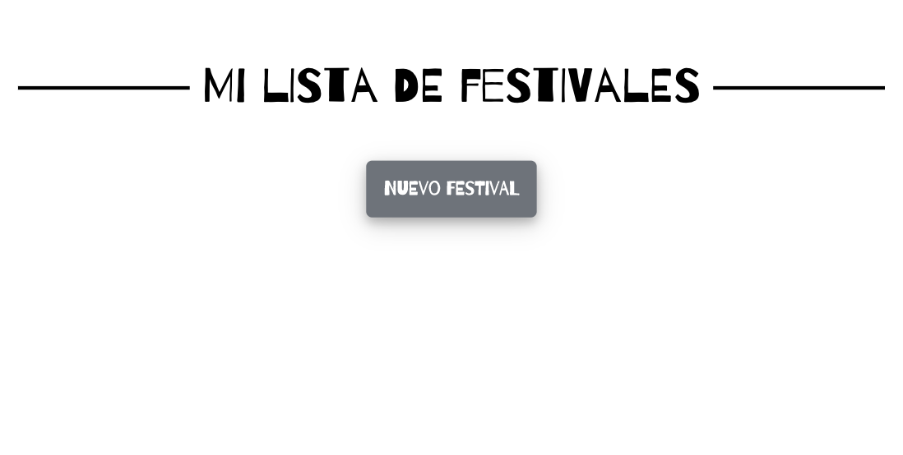

# vuevixens-pwa

## Pasos para crear proyecto de una Progressive Web App (PWA) con Vue

Para poder seguir este tutorial el necesario tener instalado `npm` y `vue CLI`.

Comprueba si los tienes intalado con:
```
npm -v
vue --version
```
### ¿Qué aplicación vamos a hacer?   
Vamos a crear una app para listar festivales de música, la aplicación consta de una pantalla inicialmente vacía con un botón añadir que nos redirige a la página de crear un elemento nuevo, una vez creado se redirige a la página principal con el listado de elementos añadidos. El aspecto es el siguiente:

   
<br/>
   
<br/>
    


## 1. Instalar aplicación "Mis festivales favoritos"

1. Descargamos el proyecto en esta rama `main-app`.
2. Ejecutamos el comando `npm install` para instalar todas las dependencias.

Con esto ya tendríamos nuestra aplicación básica creada, la porbamos ejecutando `npm run serve` pero... ¡¡esto no es una PWA!!

## 2. Configuración de la PWA

Crear nuevo fichero `vue.config.js` en la raiz del proyecto (al nivel de package.json) y pegar el siguiente contenido:

```
module.exports = {
  devServer: {
    https: true
  },
  pwa: {
    name: "Mis festivales favoritos",
    startUrl: "index.html",
    display: "standalone", //display ascpect (normal, fullscreen or minimal-ui)
    themeColor: "#3eb984",
    backgroundColor: "#fff",
  }
}

```

## 3. Ejecutar la aplicación
Para lanzar la aplicación y poderla usar en modo PWA es necesario construir el paquete de producción para ello:

1. Instalaremos el paquete `serve` ejecutando en la consola (comprobar si ya lo tenemos instalado con `serve -v` y nos saltamos este paso):
```
sudo npm install -g serve
```

2. Creamos el paquete de producción del proyecto:
```
npm run build
```
   
3. Lanzamos la app generada para producción en entorno local, desde la raíz del proyecto ejecutamos en consola:

```
serve dist/
```

4. Comprobamos que los serviceWorker están funcionando:   
Accedemos a la consola de desarrollo del navegador e inspeccionamos la aplicación.


5. Comprobamos que la aplicacioón es instalable en nuestro dispositivo:   
- En el ordenador: desde el navegador en la barra de la URL nos aparece la opción "instalar aplicación" y también en el menú "más opciones" del navegador nos aparece la opción de instalar.

## 4. Inlcuir notificaciones push
Para incluir este tipo de notificaciones en nustra aplicación, en primer lugar debemos tener un servidor que gestionará las notificaciones, en este caso utilizaremos el servicio de Firebase y lo configuraremos de la siguiente forma:

1. Ir a la consola de firebase (https://console.firebase.google.com/?hl=es-419&pli=1), también se puede buscar en Google "Firebase".   
2. Crear nuevo proyecto en firebase con el nombre deseado y aceptar las condiciones de uso.   
3. Ir a configuración, en la parte izquierda superior, pinchar sobre el icono de configuración y seleccionar “Configuración del proyecto”:


Ir a la pestaña "Cloud Messaging", al final de este apartado aparece la opción para activar los certificados push web. Hacemos click en "Generar par de claves" y nos aparecerá una clave junto con la fecha de creación.   

4. En nuestro proyecto Vue también tendremos que instalar firebase. Ejecutamos en la consola los siguientes comandos:
```
sudo npm install --save firebase

firebase init functions

❯ ? Please select an option: Use an existing project
❯ ? Select a default Firebase project for this directory: vuevixens-pwa
❯ ? What language would you like to use to write Cloud Functions? (Use arrow keys): JavaScript
❯ ? Do you want to install dependencies with npm now? Yes

npm install firebase-admin --save
npm install axios --save

npm run build
```


5. En el proyecto creamos un nuevo fichero llamado `firebase-messaging-sw.js` en la ruta public/ con el siguiente contenido. Dónde MessagingSenderId será nuestro "Id de remitente" de firebase: 
```
importScripts('https://www.gstatic.com/firebasejs/5.5.6/firebase-app.js');
importScripts('https://www.gstatic.com/firebasejs/5.5.6/firebase-messaging.js');

firebase.initializeApp({'messagingSenderId': "xxxxxxx"});

const messaging = firebase.messaging();
```   


6. Creamos otro nuevo fichero llamado `firebase-config.js` en la ruta de la aplicación (en src/) con el siguiente contenido:
```
import firebase from 'firebase/app';
import 'firebase/messaging';

export const Firebase = {
  init() {
    const config = {
      apiKey: "xxxx",
      authDomain: "vuevixens-pwa.firebaseapp.com",
      databaseURL: "https://vuevixens-pwa.firebaseio.com",
      projectId: "vuevixens-pwa",
      storageBucket: "vuevixens-pwa.appspot.com",
      messagingSenderId: "xxxx",
      appId: "xxxxxxxx",
      measurementId: "xxxx"
    };
    
    firebase.initializeApp(config);
  },

  messaging() {
    const msg = firebase.messaging();
  
    msg.usePublicVapidKey("xxxxxx");

    console.log('Set firebase messaging config')

    return msg;
  }
}

export default Firebase
```
   
El campo **usePublicVapidKey** se rellenará con el Cerfificado de par de claves envío web generado anteriormente:   


La configuración se puede obtener de la consola de firebase: apartado "settings" --> "general", en la parte inferior "Aplicaciones web":


Posteriormente tenemos que agregar el SDK de firebase a nuestra applicación, para ello primero debemos descargar la clave privada accediendo a la consola de firebase:


Guardaremos el fichero en nuestro ordenador y añadiremos esa ruta en el fichero creado anteriormente `firebase-config.js` de la siguiente forma (en este caso la ruta del fichero descargado con la clave es `/Users/bmontalvo/Documents/Vixens/firebase-adminsdk.json` ):
```
...
...
import * as admin from 'firebase-admin';
import serviceAccount from '/Users/bmontalvo/Documents/Vixens/firebase-adminsdk.json';

const config = {
      ...
      ...
      credential: admin.credential.cert(serviceAccount),
    };
```

7. Por último añadimos la configuración necesaria para enviar notificaciones en el fichero `main.js`:   
Tener en cuenta que hay que sustituir el campo <App_name> en la URL de la petición por el normbre de nuestra aplicación en firebase y el campo <Clave de servidor> de la cabecera de autenticación.   
```
import Firebase from './firebase-config.js'
import axios from 'axios'

Firebase.init()
const messaging = Firebase.messaging()

// [START refresh_token]
  // Callback fired if Instance ID token is updated.
  messaging.onTokenRefresh(() => {
    messaging.getToken().then((refreshedToken) => {
      // Send Instance ID token to app server.
      sendTokenToServer(refreshedToken);
    }).catch((err) => {
      console.log('Unable to retrieve refreshed token ', err);
    });
  });
  // [END refresh_token]

  // [START receive_message]
  // Handle incoming messages. Called when:
  // - a message is received while the app has focus
  // - the user clicks on an app notification created by a service worker
  //   `messaging.setBackgroundMessageHandler` handler.
  messaging.onMessage((payload) => {
    console.log('Message received. ', payload);
  });
  // [END receive_message]


  // Send the Instance ID token your application server, so that it can:
  // - send messages back to this app
  // - subscribe/unsubscribe the token from topics
  function sendTokenToServer(currentToken) {
    if (!isTokenSentToServer()) {
      console.log('Sending token to server... ', currentToken);
      axios.post('https://iid.googleapis.com/iid/v1/' + currentToken + '/rel/topics/<App_name>', '', 
      {
        headers:
        {
          'Authorization': 'Bearer <Clave de servidor>',
          'Content-Type': 'application/json'
        }
      } 
      )
      .then(response => {
        console.log('Success', response)
      })
      .catch(err => {
        console.error(err)
      })
    } else {
      console.log('Token already sent to server so won\'t send it again ' +
          'unless it changes');
    }

  }

  function isTokenSentToServer() {
    return window.localStorage.getItem('sentToServer') === '1';
  }

  function setTokenSentToServer(sent) {
    window.localStorage.setItem('sentToServer', sent ? '1' : '0');
  }

Notification.requestPermission().then((permission) => {
  if (permission === 'granted') {
    console.log('Notification permission granted.');
    getCurrentToken()
  } else {
    console.log('Unable to get permission to notify.');
  }
});

const getCurrentToken = () => {
  // Get Instance ID token. Initially this makes a network call, once retrieved
  // subsequent calls to getToken will return from cache.
  messaging.getToken().then((currentToken) => {
    if (currentToken) {
      sendTokenToServer(currentToken);
    } else {
      // Show permission request.
      console.log('No Instance ID token available. Request permission to generate one.');
      // Show permission UI.
      setTokenSentToServer(false);
    }
  }).catch((err) => {
    console.log('An error occurred while retrieving token. ', err);
    setTokenSentToServer(false);
  });
}
```

Volvemos a generar la aplicación en modo producción y... ¡hemos terminado!   


8. Para probar que las notificaciones funcionan correctamente podemos acceder a la consola de firebase y crear una nueva aplicación de prueba https://console.firebase.google.com/u/0/project/_/notification?hl=es. El token de registro FCM que se debe añadir a la notificación es el que se muestra como traza por consola en la aplicación, se pueden registrar tantos tokens como dispositivos.

## Extras

- Añadir icono de la aplicación: añade la imagen deseada en la ruta /src/public/img/icons y añade la configuración en el fichero `vue.config.js` de la siguiente forma dentro de la clave pwa:
```
iconPaths: {
      favicon32: 'img/icons/party_icon.png',
      favicon16: 'img/icons/party_icon.png',
      appleTouchIcon: 'img/icons/party_icon.png',
      maskIcon: 'img/icons/party_icon.png',
      msTileImage: 'img/icons/party_icon.png'
    },
    manifestOptions: {
      icons: [
        { src: "./img/icons/party_icon.png", "sizes": "192x192", "type": "image/png" }, 
        { src: "./img/icons/party_icon.png", "sizes": "512x512", "type": "image/png" }, 
        { src: "./img/icons/party_icon.png", "sizes": "192x192", "type": "image/png", "purpose": "maskable" }, 
        { src: "./img/icons/party_icon.png", "sizes": "512x512", "type": "image/png", "purpose": "maskable" }
      ]
    }
```

- Alojar la aplicación en servidor de firebase para utilizarla por https:
```
firebase init hosting
```

En este paso se aplicará la siguiente configuración:   
> ? What do you want to use as your public directory? **dist**   
> ? Configure as a single-page app (rewrite all urls to /index.html)? (y/N) **y**   
> ? File dist/index.html already exists. Overwrite? **y**   

```
firebase deploy --only hosting

npm run build

firebase deploy
```